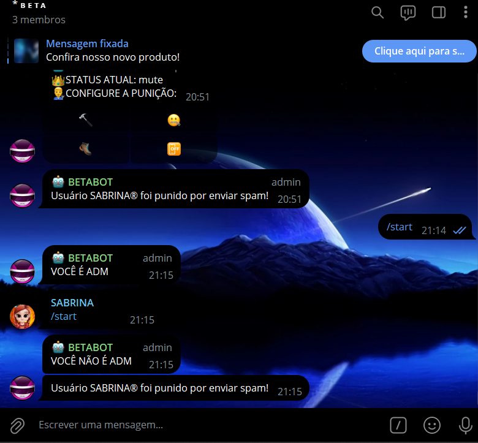
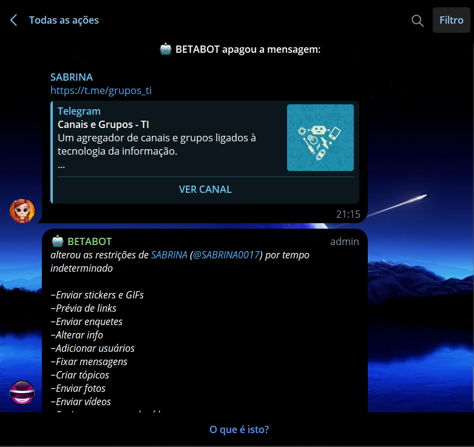

# MODERADOR ANTISPAM 
👮‍♂️ESSE É UM BOT DO TELEGRAM QUE PENALISA OS MEMBROS QUE ENVIAREM SPAM!

 <br>
 <br>

## DESCRIÇÃO:
Este bot é um moderador de grupos do Telegram, desenvolvido para ajudar a gerenciar o conteúdo enviado nos grupos. Ele possui as seguintes funcionalidades principais:

1. **Responder ao Comando `/start`**:
   - Se o comando `/start` for enviado em uma conversa privada com o bot, ele responderá com uma mensagem de boas-vindas.
   - Se o comando `/start` for enviado em um grupo, o bot verificará se o usuário que enviou o comando é um administrador do grupo:
     - Se o usuário for um administrador, o bot responderá com "VOCÊ É ADM".
     - Se o usuário não for um administrador, o bot responderá com "VOCÊ NÃO É ADM".

2. **Anti-Spam**:
   - O bot monitora todas as mensagens enviadas no grupo.
   - Se uma mensagem contiver links (URLs) e for enviada por um usuário que não é administrador, o bot:
     - Excluirá a mensagem.
     - Aplicará uma punição ao usuário, conforme definido no arquivo `CONFIG.json`.
     - Enviará uma mensagem ao grupo informando que o usuário foi punido por enviar spam.

3. **Aplicar Punição**:
   - As punições possíveis são:
     - `ban`: Expulsa o usuário do grupo.
     - `mute`: Restringe as permissões do usuário, efetivamente silenciando-o.
     - `kick`: Remove o usuário do grupo, mas permite que ele volte.
     - `off`: Não aplica nenhuma punição.
   - A punição aplicada é configurada no arquivo `CONFIG.json`.

## EXECUTANDO O PROJETO:
1. **Coloque o Token:**
   - Antes de executar o bot, é necessário substituir o token do seu bot no arquivo `TOKEN.py`, o qual pode ser obtido por meio do [@BotFather](https://t.me/BotFather).

2. **Instalando as dependências:**
   - Antes de executar o bot, certifique-se de instalar todas as dependências necessárias. No terminal, execute o seguinte comando para instalar as dependências listadas no arquivo `requirements.txt` em `CODIGO`:
   ```bash
   pip install -r requirements.txt
   ```

3. **Inicie o Bot:**
   - Execute o bot do Telegram em Python iniciando-o com o seguinte comando:
   ```bash
   python CODIGO.py
   ```

4. **Adicione o bot ao Grupo:**
   - Adicione o bot ao grupo e dê as permissões de administrador.

## ARQUIVO `CONFIG.json`:
O arquivo `CONFIG.json` define a punição universal que será aplicada a qualquer usuário que enviar mensagens com links (consideradas como spam) no grupo. Aqui está um exemplo de como o arquivo deve ser estruturado:

```json
{
   "punishment": "mute"
}
```

Para personalizar a punição aplicada pelo bot, edite o valor do campo `punishment` no arquivo `CONFIG.json`. As opções disponíveis são:

- `"ban"`: Para expulsar o usuário do grupo.
- `"mute"`: Para silenciar o usuário no grupo.
- `"kick"`: Para remover o usuário do grupo, permitindo que ele volte.
- `"off"`: Para não aplicar nenhuma punição.

## NÃO SABE?
- Entendemos que para manipular arquivos em muitas linguagens e tecnologias relacionadas, é necessário possuir conhecimento nessas áreas. Para auxiliar nesse aprendizado, oferecemos alguns subsidios:
* [CURSO DE PYTHON](https://github.com/VILHALVA/CURSO-DE-PYTHON)
* [CURSO DE TELEBOT](https://github.com/VILHALVA/CURSO-DE-TELEBOT)
* [CURSO DE JSON](https://github.com/VILHALVA/CURSO-DE-JSON)
* [CONFIRA MAIS CURSOS](https://github.com/VILHALVA?tab=repositories&q=+topic:CURSO)

## CREDITOS:
- [VERSÃO LITE DO BOT "MODERADOR ANTISPAM SQLITE"](https://github.com/VILHALVA/MODERADOR-ANTISPAM-SQLITE)
- [PROJETO FEITO PELO VILHALVA](https://github.com/VILHALVA)
